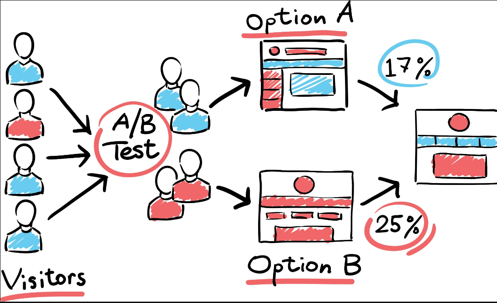

# Statistical Analysis & ML Preparation

## 1. Descriptive Statistics

Before building complex models, you must understand the shape, center, and spread of your data. This phase is often called Exploratory Data Analysis (EDA).

### A. Measures of Central Tendency

These metrics determine where the "center" of your data lies.

* **Mean ():** The arithmetic average. Highly sensitive to outliers.
* **Median:** The middle value when sorted. Robust against outliers (preferred for Salary or House Price data).
* **Mode:** The most frequent value. Used for categorical data.

### B. Measures of Dispersion (Spread)

These metrics tell you how "spread out" or "noisy" the data is.

* **Variance ():** The average squared deviation from the mean.
* **Standard Deviation ():** The square root of variance. It is easier to interpret because it is in the same units as the original data.
* **Interquartile Range (IQR):** The difference between the 75th percentile (Q3) and the 25th percentile (Q1). It describes the middle 50% of values and is used to detect outliers.

### C. Measures of Shape

* **Skewness:** Measures asymmetry.
* *Positive Skew (Right):* Tail is on the right (e.g., Wealth distribution). Mean > Median.
* *Negative Skew (Left):* Tail is on the left (e.g., Age at death). Mean < Median.


* **Kurtosis:** Measures the "tailedness" (peakedness). High kurtosis means frequent extreme outliers (fat tails).

```python
import pandas as pd
df = pd.read_csv("data.csv")

# Quick Summary
print(df.describe()) 

# Check Skew
print(df['salary'].skew()) # > 1 implies highly skewed

```

---

## 2. Hypothesis Testing

Hypothesis testing is a formal statistical method used to accept or reject a theory about a population based on sample data.

### Core Concepts

1. **Null Hypothesis ():** The default assumption. "There is no difference" or "The drug has no effect."
2. **Alternative Hypothesis ( or ):** The claim you want to test. "There IS a difference" or "The drug works."
3. **p-value:** The probability of observing the results if  were true.
* **Rule of Thumb:** If p-value < 0.05 (Alpha), reject . (The result is statistically significant).


4. **Type I Error (False Positive):** Rejecting  when it is actually true.
5. **Type II Error (False Negative):** Failing to reject  when it is actually false.

### Common Tests

* **T-Test:** Compares the means of two groups. (e.g., Do Men and Women have the same average height?)
* **ANOVA (Analysis of Variance):** Compares the means of 3+ groups.
* **Chi-Square Test:** Checks relationship between two categorical variables. (e.g., Is "Pet Preference" related to "Marital Status"?)

---

## 3. A/B Test Design

A/B testing (Split Testing) is the gold standard for causal inference in product development. It applies hypothesis testing to user experience.



### Step 1: Design & Power Analysis

Before running the test, you must calculate **Sample Size**.

* **Power (1 - ):** Probability of detecting an effect if it exists (usually set to 80%).
* **Significance Level ():** usually 0.05.
* **Minimum Detectable Effect (MDE):** The smallest improvement you care about (e.g., "I only care if conversion improves by 1%").

### Step 2: Randomization

Users must be randomly assigned to **Control (A)** or **Variant (B)**.

* **Hashing:** A common technique is `hash(user_id) % 100`. If result < 50, assign to A; else B. This ensures the same user always sees the same version.

### Step 3: Metric Selection

* **Invariant Metrics:** Metrics that should *not* change (e.g., number of cookies set). Used for sanity checks.
* **Evaluation Metrics:** The metric you want to improve (e.g., Conversion Rate, Click-Through Rate).

### Step 4: The Peeking Problem

**Do not check p-values daily.** If you peek at the results every day and stop as soon as it looks significant, you drastically increase your False Positive rate. Stick to the predetermined sample size.

---

## 4. Feature Engineering

Machine Learning models cannot learn from raw text or messy database rows. Feature engineering is the art of transforming raw data into mathematical representations (features) that models can understand.

### A. Handling Missing Data (Imputation)

* **Drop:** Remove rows with missing values (only if dataset is huge and missingness is rare).
* **Mean/Median Imputation:** Fill with the average. (Fast, but distorts distribution).
* **KNN Imputation:** Find the "nearest neighbors" (similar rows) and use their values to fill the gap. (More accurate, computationally expensive).

### B. Encoding Categorical Variables

Models require numbers, not strings like "Red" or "Blue".

1. **Label Encoding:** Assigns integers (Red=1, Blue=2, Green=3).
* *Risk:* The model might think Green (3) is "greater than" Red (1). Only use for Ordinal data (Low/Med/High).


2. **One-Hot Encoding (OHE):** Creates a binary column for each category.
* *Result:* `is_red`, `is_blue`, `is_green`.
* *Risk:* **Curse of Dimensionality**. If you have a zip code column with 10,000 unique values, OHE creates 10,000 columns, making the dataset huge and sparse.


### C. Scaling (Normalization)

Many algorithms (SVM, K-Means, Linear Regression) are sensitive to the scale of data. Distance calculations fail if one feature is 0-1 and another is 0-1,000,000.

* **Standard Scaler (Z-Score):** Centers data around 0 with a standard deviation of 1. Best for normal distributions.


* **MinMax Scaler:** Squeezes data between 0 and 1. Preserves the exact shape of the distribution but is sensitive to outliers.

### D. Feature Creation

Creating new information from existing data.

* **Binning:** Converting continuous `Age` into buckets `18-25`, `26-35`. Helps handle non-linear relationships.
* **Interaction Features:** Multiplying two features together (e.g., `feature_A * feature_B`) to capture combined effects.
* **Date Extraction:** Breaking `2024-01-01` into `DayOfWeek`, `IsWeekend`, `Month`.