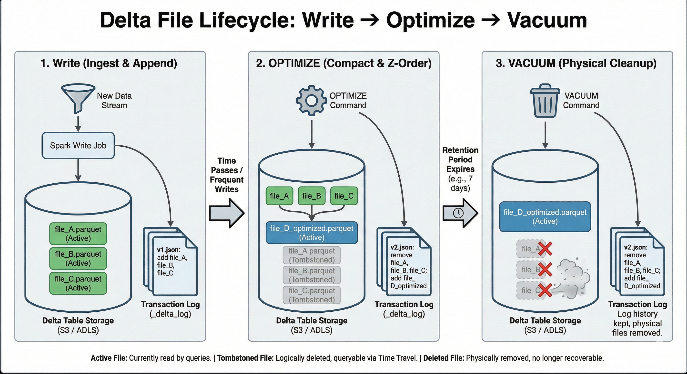

# Advanced Delta Lake Features

---

## 1. Time Travel (Version History)

Time Travel allows you to query earlier versions of your data. Because Delta Lake is immutable (it never overwrites files, only adds new ones and marks old ones as "stale" in the log), every previous version of the table still physically exists on the disk until you delete it.

### How it works

Delta Lake keeps a **Transaction Log** (`_delta_log`). Every operation (Write, Update, Delete) creates a new JSON commit file (e.g., `00001.json`, `00002.json`).

* **Version 0:** Created initial data.
* **Version 1:** Overwrote partition A.
* **Version 2:** Deleted rows where `id < 100`.

To "Time Travel," Spark simply reads the transaction log up to the specified version and ignores any commit files that came after it.

### Syntax and Usage

You can query by **Version ID** or by **Timestamp**.

```python
# Option 1: Query by Version Number
df_v1 = spark.read \
  .format("delta") \
  .option("versionAsOf", 1) \
  .load("/mnt/delta/events")

# Option 2: Query by Timestamp
df_old = spark.read \
  .format("delta") \
  .option("timestampAsOf", "2023-10-01 12:00:00") \
  .load("/mnt/delta/events")

# Option 3: SQL Syntax
spark.sql("SELECT * FROM events TIMESTAMP AS OF '2023-10-01'")
spark.sql("SELECT * FROM events VERSION AS OF 5")

```

### Use Cases

1. **Auditing:** "What did the data look like last Tuesday when the report was generated?"
2. **Rollbacks:** accidentally deleted data? You can simply read the previous version and overwrite the current table with it.
3. **Reproducibility:** Ensuring machine learning models are trained on the exact same dataset snapshot.

---

## 2. MERGE Operations (Upserts)

The `MERGE` statement is the "Swiss Army Knife" of Delta Lake. It enables **Upserts** (Update + Insert), which is standard in databases (like SQL Server or PostgreSQL) but was historically impossible in data lakes (Hive/Hadoop).

### The Logic

`MERGE` joins a **Source** (new data) with a **Target** (existing Delta table).

* **When Matched:** Update the existing record.
* **When Not Matched:** Insert the new record.
* **When Not Matched by Source:** (Optional) Delete the target record.

### Code Example (CDC - Change Data Capture)

Scenario: You have a stream of user updates. Some users are new (Insert), some are changing their email (Update).

```python
from delta.tables import *

deltaTable = DeltaTable.forPath(spark, "/mnt/delta/users")
newData = spark.read.parquet("/mnt/incoming/updates")

deltaTable.alias("old") \
  .merge(
    newData.alias("new"),
    "old.user_id = new.user_id" # The Condition
  ) \
  .whenMatchedUpdate(set = {
    "email": "new.email",
    "updated_at": "new.updated_at"
  }) \
  .whenNotMatchedInsert(values = {
    "user_id": "new.user_id",
    "email": "new.email",
    "created_at": "current_timestamp()",
    "updated_at": "current_timestamp()"
  }) \
  .execute()

```

---

## 3. OPTIMIZE and ZORDER

Performance in data lakes often degrades over time due to the **"Small File Problem"**. Streaming jobs or frequent small merges create thousands of tiny files (kilobytes in size). Opening and closing these files creates massive overhead for Spark.

### OPTIMIZE (Bin-Packing)

The `OPTIMIZE` command compacts these small files into larger files (usually around 1GB).

* It reads the small files and rewrites them as fewer, larger files.
* It does **not** block readers.
* It is idempotent (running it twice on already optimized data does nothing).

### ZORDER (Multi-Dimensional Clustering)

`ZORDER` is a technique to co-locate related information in the same set of files. It maps multi-dimensional data to one dimension while preserving locality.

* **Without Z-Order:** Data is scattered randomly across files. To find `Department=Sales` and `Region=US`, Spark might have to open every single file.
* **With Z-Order:** Data points with similar `Department` and `Region` are physically written next to each other in the same files.

**Why is it faster? (Data Skipping)**
Delta Lake automatically collects statistics (min/max values) for the first 32 columns of every file.
If you Z-Order by `id`:

* **File A:** min_id=1, max_id=100
* **File B:** min_id=101, max_id=200

If you query `WHERE id = 50`, Spark reads the stats, sees that File B starts at 101, and **completely skips** reading File B.

```sql
-- SQL Syntax
OPTIMIZE events
ZORDER BY (event_type, region_id)

```

---

## 4. VACUUM (Cleanup)

Because Delta Lake keeps all history (Time Travel), storage costs will grow indefinitely if you never delete old files. `VACUUM` is the garbage collector.

### How it works

`VACUUM` removes files that are:

1. No longer in the latest state of the table.
2. **Older than the retention period** (default is 7 days).

### The Trade-off

Once you VACUUM, **you lose the ability to Time Travel back past the retention period**. If you vacuum files older than 7 days, you can no longer query "Version as of 8 days ago."

```python
# Dry run: See what WOULD be deleted without actually deleting
deltaTable.vacuum(retentionHours=168) # 168 hours = 7 days

# Execute delete
deltaTable.vacuum(0) # WARNING: This cleans up everything not currently used.
# Note: Spark prevents vacuum(0) by default to prevent accidental data loss.
# You must set 'spark.databricks.delta.retentionDurationCheck.enabled = false' to override.

```

### Best Practice

* Run `OPTIMIZE` frequently (e.g., daily) to keep query performance high.
* Run `VACUUM` less frequently (e.g., weekly) to manage storage costs, ensuring you keep enough history for audit requirements.

---


### Delta File Lifecycle