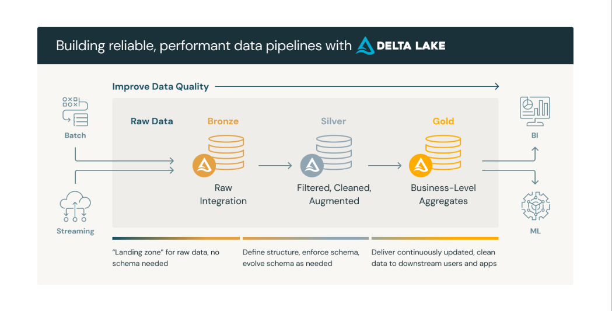

# The Medallion Architecture: 

**Medallion Architecture** (also known as the Multi-hop Architecture), a data design pattern used to logically organize data in a Lakehouse. The goal is simple: incrementally improve the quality of data as it flows through each layer of the architecture (Bronze  Silver  Gold).

---

## 1. Overview of Layers

The architecture consists of three distinct layers, each serving a specific purpose in the data lifecycle.

### 🥉 Bronze Layer (Raw Ingestion)

**The "Dump" Zone.**

* **Purpose:** To capture data from external source systems as quickly and accurately as possible.
* **State:** The data here is **Raw** and **Unverified**. It is an exact copy of the source.
* **Format:** Typically stored in Delta format (for reliability) or original file formats (JSON, CSV, Avro).
* **Retention:** Often indefinite. If you find a bug in your cleaning logic 2 years later, you can reprocess everything from Bronze.

### 🥈 Silver Layer (Refined / Enriched)

**The "Single Source of Truth."**

* **Purpose:** To clean, filter, and structure the data into a queryable format. This is where you fix data quality issues.
* **State:** The data here is **Cleaned**, **Conformed**, and **Trusted**.
* **Transformations:** Deduplication, schema enforcement, converting strings to dates, and joining with reference data (e.g., adding `CustomerName` to `OrderEvents`).
* **Usage:** Data Scientists often use this layer for ad-hoc analysis and ML feature engineering because it has the granular transaction details.

### 🥇 Gold Layer (Aggregated / Business)

**The "Presentation" Zone.**

* **Purpose:** To organize data for consumption by business intelligence (BI) tools and reporting.
* **State:** The data here is **Aggregated**, **Highly Structured**, and **Read-Optimized**.
* **Structure:** Often modeled as **Star Schemas** (Fact and Dimension tables).
* **Usage:** CEOs viewing dashboards, financial reporting, and customer metrics (e.g., "Daily Active Users", "Monthly Recurring Revenue").

---

## 2. Deep Dive & Best Practices by Layer

### 🥉 Bronze: Best Practices

1. **Append-Only:** Do not try to update or delete rows in Bronze (unless for GDPR/Compliance). Just append new data files as they arrive.
2. **Keep Metadata:** Always add metadata columns like `_ingest_timestamp` and `_source_file_name`. This helps in debugging exactly when and where bad data came from.
3. **No Schema Validation:** Do not fail the ingestion if a column type changes. Bronze should accept *everything* to prevent data loss at the source. Store unexpected schema changes in a "rescue data" column if using Delta Lake.

```python
# Example: Ingesting to Bronze with Auto Loader
spark.readStream.format("cloudFiles") \
  .option("cloudFiles.format", "json") \
  .load("/mnt/landing/iot_data") \
  .withColumn("ingest_time", current_timestamp()) \ # Best Practice: Metadata
  .writeStream \
  .format("delta") \
  .outputMode("append") \
  .option("checkpointLocation", "/mnt/bronze/_checkpoints/iot") \
  .start("/mnt/bronze/iot_events")

```

### 🥈 Silver: Best Practices

1. **Filter Dirt:** Remove nulls in critical keys, standardize date formats (YYYY-MM-DD), and trim whitespace.
2. **Deduplicate:** This is the most critical step. Ensure unique records exist for your primary keys.
3. **Enrich:** Perform lookups (joins) here. For example, replace a `store_id` with `Store Name` and `Region`.
4. **Schema Enforcement:** Silver should be strict. If data doesn't fit the schema, it should be quarantined (sent to a separate "Bad Data" table), not written to the main Silver table.

```python
# Example: Silver Transformation (Dedup + Clean)
spark.readStream.table("bronze_iot_events") \
  .filter("temperature IS NOT NULL") \ # Cleaning
  .dropDuplicates(["device_id", "timestamp"]) \ # Deduping
  .writeStream \
  .format("delta") \
  .outputMode("append") \
  .option("mergeSchema", "true") \ # Allow evolution if safe
  .start("/mnt/silver/iot_cleaned")

```

### 🥇 Gold: Best Practices

1. **Read-Optimized:** Use heavy optimization here. Apply `ZORDER` on columns frequently used in dashboard filters (e.g., `Date` or `Region`).
2. **Business Logic Only:** Do not perform data cleaning in Gold. If you find dirty data in Gold, fix the pipeline in Silver, don't patch it in Gold.
3. **Star Schema:** separate data into Fact Tables (Transactions) and Dimension Tables (Context). This allows PowerBI/Tableau to run highly efficient queries.
4. **Aggregations:** Pre-calculate complex KPIs. Instead of a table with 1 billion raw clicks, store a table with "Daily Clicks per Region" (1000 rows).

---

## 3. Incremental Processing Patterns

Processing 10 years of data every hour is expensive and slow. **Incremental Processing** ensures you only process data that has arrived since the last run.

### A. Structured Streaming (The "Always On" Approach)

This is the standard for modern Lakehouses. Even if your job runs once a day (Batch), you can use Spark Structured Streaming triggers (`trigger(availableNow=True)`).

* **Mechanism:** It maintains a **Checkpoint**. The checkpoint records exactly which file or offset was processed last.
* **Benefit:** If the job crashes, it restarts exactly where it left off. No duplicate data, no missed data.

### B. Auto Loader (Cloud-Native Ingestion)

A Databricks-specific pattern that efficiently detects new files in S3/ADLS without listing millions of files.

* **Mechanism:** Uses cloud notification services (SNS/SQS or Event Grid) to "listen" for file arrival events.
* **Best for:** Bronze ingestion when you have millions of files landing.

### C. The `MERGE` Pattern (CDC - Change Data Capture)

Used primarily when moving from Bronze to Silver to handle updates.

* **Scenario:** You receive a file saying "Order #123 status changed to Shipped".
* **Pattern:** You cannot just append this to Silver, or you will have two rows for Order #123. You must `MERGE`.

```python
# Incremental Merge Pattern (pseudo-code)
def upsert_to_silver(microBatchDF, batchId):
    silverTable.alias("t").merge(
        microBatchDF.alias("s"),
        "t.id = s.id") \
    .whenMatchedUpdateAll() \
    .whenNotMatchedInsertAll() \
    .execute()

# Connect the stream to the function
spark.readStream.table("bronze_updates") \
    .writeStream \
    .foreachBatch(upsert_to_silver) \
    .start()

```

### D. Watermarking (Handling Late Data)

Used in aggregations (Silver  Gold).

* **Problem:** An IoT device goes offline and sends data 3 hours late.
* **Solution:** A watermark defines how late data can be before it is dropped. `withWatermark("timestamp", "2 hours")` tells the engine to keep the aggregation state open for 2 hours to allow late arrivals to update the count.

---



