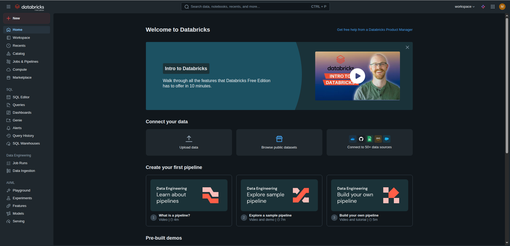
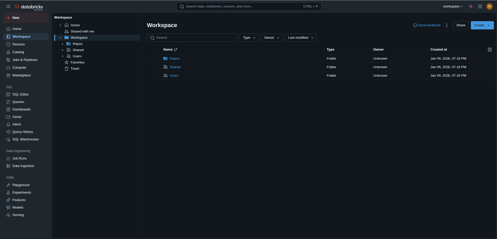
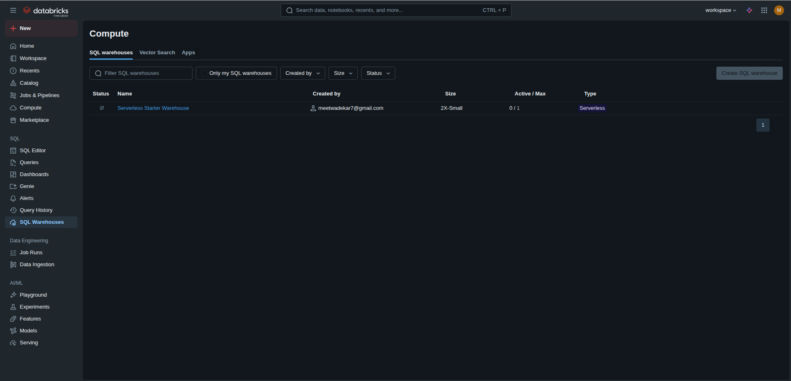
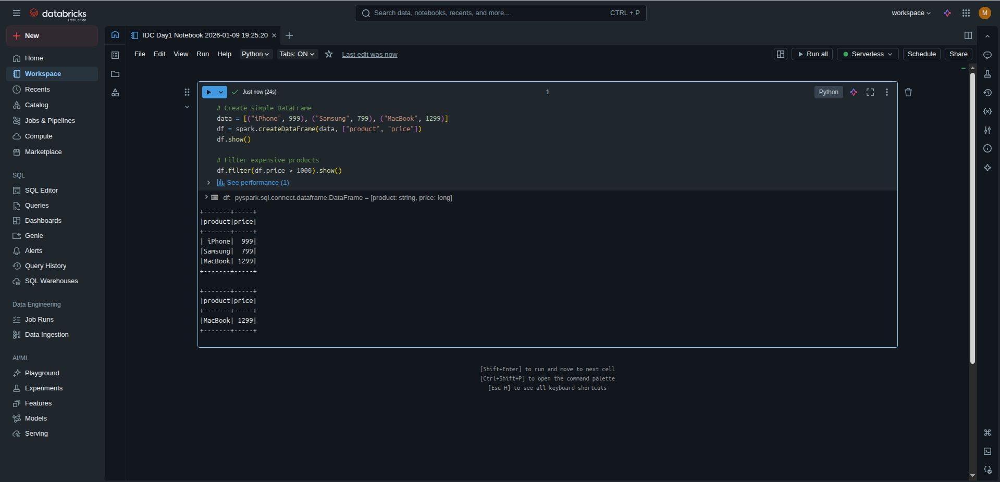
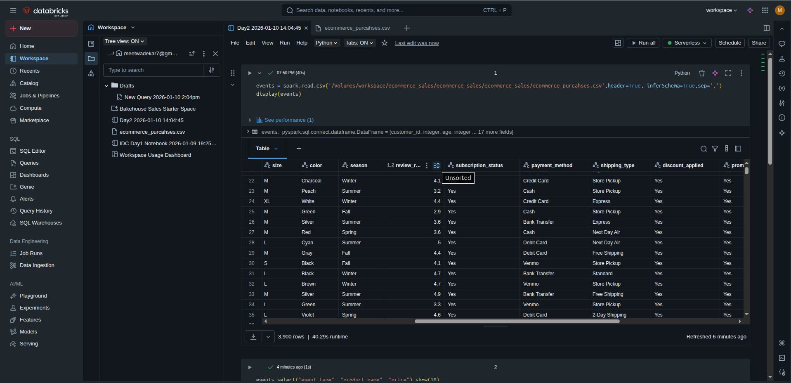
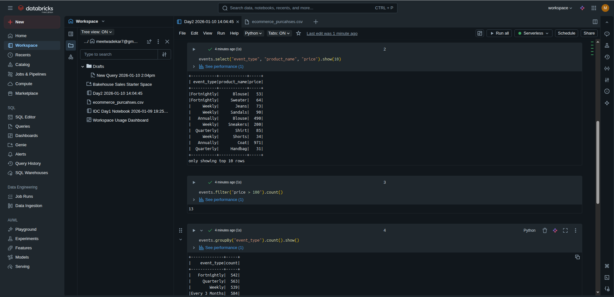
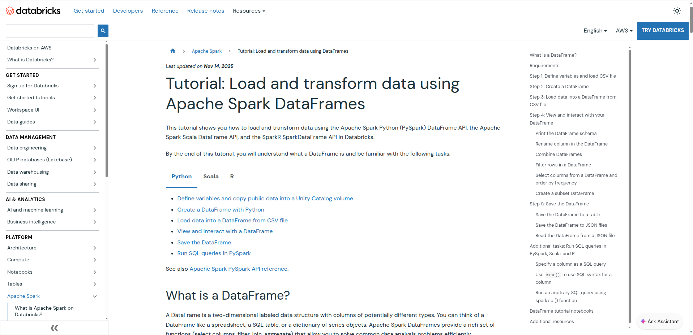
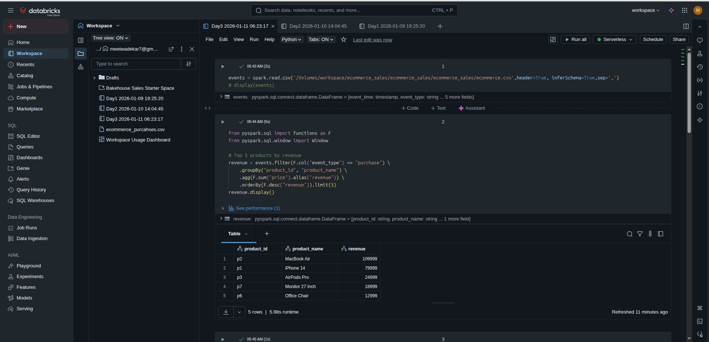
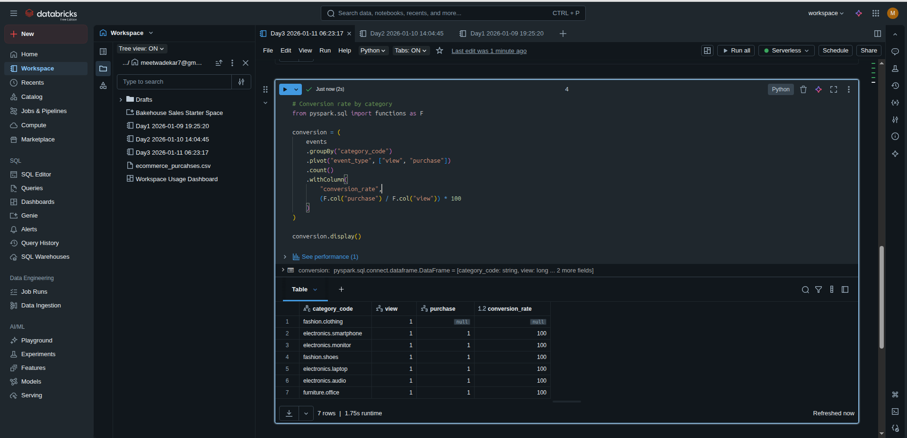

# IDC-14-Days-Challenge
This Repo is for submission for IDC 21 Days Challenge Submission 

The challenge is organised by [DataBricks](https://docs.databricks.com/aws/en/introduction/) [CodeBasics](https://codebasics.io/) [IndianDataClub](https://www.indiandataclub.com/)

# Phase 1

## Day 1 
### Learn:

- Why Databricks vs Pandas/Hadoop?
- Lakehouse architecture basics
- Databricks workspace structure
- Industry use cases (Netflix, Shell, Comcast)

### Tasks:

1. Create Databricks Community Edition account
2. Navigate Workspace, Compute, Data Explorer
3. Create first notebook
4. Run basic PySpark commands

**HomePage**

**WorkSpace**

**Compute**

**NoteBook**

## Day 2
### Explored about Apache Spark Fundamentals

### Learn:

- Spark architecture (driver, executors, DAG)
- DataFrames vs RDDs
- Lazy evaluation
- Notebook magic commands (`%sql`, `%python`, `%fs`)

### 🛠️ Tasks:

1. Upload sample e-commerce CSV
2. Read data into DataFrame
3. Perform basic operations: select, filter, groupBy, orderBy
4. Export results

**Loading Data**

**Basic Operations**

**Apache Spark Docs**

# Day 3
### PySpark Transformations Deep Dive**

### Learn:

- PySpark vs Pandas comparison
- Joins (inner, left, right, outer)
- Window functions (running totals, rankings)
- User-Defined Functions (UDFs)

### 🛠️ Tasks:

1. Load full e-commerce dataset
2. Perform complex joins
3. Calculate running totals with window functions
4. Create derived features

